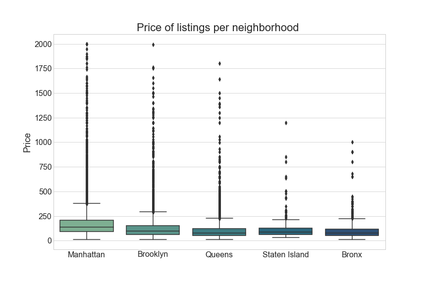

# Project Airbnb 
---

Airbnb is an online marketplace that connects people who want to rent out their homes with people who are looking for accommodations in specific locales.

## Problem statement

My project aims to help people set the best possible price for their Airbnb listing. Using different types of regression models, the model can predict what the most standard price will be for a new listing based on various factors, such as location, rooms, number of accommodations, etc.

Using natural language processing (NLP) analysis, I collected common verbs and text from a large sample of existing Airbnb listings in New York. This data is useful when predicting the price of listings.

With the help of time series models like ARIMA and fbprophet, analyze if there are any kind of trends or seasons in relation to the price. At the same try to predict the average price over time.

## Data gathering 

This data was taken from http://insideairbnb.com/get-the-data.html. The data behind the Inside Airbnb site is sourced from publicly available information from the Airbnb site. For the purpose of this project, we will use the data from New York City listings from February 6 and reservations from 2021 to 2022.

## Process

This project have three folders assets, code and data. 
- In the assets folder you will find the images obtained from the project. 
- In the code folder there are 3 notebooks: Airbnb notebook, EDA notebook and model notebook. These notebooks contain the description of the process.
- In the data folder contains all the datasets used for this project.

the code folder as mentioned above has 3 notebooks which have different functions.
- Airbnb notebook, is focused on data cleaning and organization.
- EDA notebook, continue the analysis through graphs and tables of listings, reviews and reservations.
- Model notebook, here we can see the results of the regression and time series models.

## Libraries an requirements needed it

The process of the process and models predictions have been created with jupyter lab using various python libraries.

The libraries used in this project are:
- Pandas
- Numpy
- Seaborn
- Plotly
- NLTK
- Sklearn
- Statsmodel
- Fbprophet

## Data dictionary 

Below we have the description of the 3 data obtained from the Airbnb website.

Description of the data [data description](https://docs.google.com/spreadsheets/d/1iWCNJcSutYqpULSQHlNyGInUvHg2BoUGoNRIGa6Szc4/edit#gid=982310896).

- Listing: this dataframe contains all the information of the listings and the hosts, from the start of Airbnb in 2008 until the month of February 2022. This dataframe started with 38185 rows and 74 columns, and after cleaning and collecting the best features, it was reduced to 38149 rows with 32 columns.
- Review: This dataframe has the information of the reviews of the listings.
- Reservations_df: Here you will find the union of the two dataframes calendar_2021 and calendar_2022, with a size greater than 13000000 rows and 7 columns. this new dataframe contains the average price and the sum of the daily availability.

Listings dataframe description:

reservation dataframe description:

## Price analysis of Airbnb listings in new york.

The boxplot graphic is a good representation of how is the price distributed, the majority of the listings are on the average of 159 dollas and there are a few listings that pass that price, for that reason the boxplot is shrinking on the avarage.

Manhattan is the neighborhood that has the majority of listings, followed by Brooklyn. The average price in Manhattan is 202 dollars and Brooklyn is 132. the majority of the prices on the boxplot are shrinking between 250 and 100 dollars. Even though Staten Island has the lowest number of listings, Bronx has the lowest average price with 101 dollars.

There are 4 types of rooms (Entire home/apt, private room, hotel room, and shared room). The hotel room has the lowest price of the other types of rooms. Most of the listings are the entire house and for the private room.

Looking at the graph we can see the number of rooms per listing and the number of listings per room. most listings have only 1 room with a total of 30366. We see that as the number of rooms increases the number of listings decreases.

## Review analysis of Airbnb listings in new york.

The neighborhood with the highest number of reviews is Brooklyn with a number of 389120 reviews, although it is not the neighborhood with the highest number of listings.

In this step, we are analyzing the reviews that the different listings have. Most of the words that we see in these graphs are of a positive aspect. This gives us to understanding that the majority of reviews are positive.

As we saw before, most of the reviews are positive, almost 10% of the reviews are negative and a small percentage is neutral. When analyzing the words of the negative reviews we see a pattern of words such as cancellation of the listings, this shows that the majority of complaints are due to the cancellation of the listing by the host.

## Time series 

When the reservations made is analyzed in a time series, a graph of descending scales is formed, this is because the reservation data has been taken on two dates (2021-02-05 to 2022-01- 31 and 2022-02-01 to 2023-01-05). As time goes by, reservations also drop.

In the graphs above we have the price of the listings during a period of time of 2 years. we see that the price has a positive trend, by breaking down the time and using the statsmodels function we can confirm that there is a positive trend and that the price is also seasonality

## Correlation

When visualizing the first graph of heat for the correlation, we see that the values with respect to the price are not very good, after cleaning some data and creating a couple of new columns, the correlation between the variables could be improved a little. This gives us indications that the models are not going to perform in the best way.

## Prediction model

For the purpose of this project, the data will be divided into two parts, training with 75% and 25% for testing.
Different types of prediction models for time series and regression will also be used.
Metrics used for the models are going to be RMSE, MSE and R-SQUARED.

### - ARIMA:

creating a function to search for the best parameters, we found that the best values were 5,0,5, and an Akaike Information Critera (AIC) of 1214.67, when filling the model with these parameters, we found that the values of MSE and RMSE for training they are good, but on the other hand when we analyze the test values we see that the values are much larger.
Analyzing the graph we see that when we predict the test values, the model after a while cannot predict the trend and starts to predict the average price.

| arima | train | test  |
|-------|-------|-------|
| MSE   | 0.76  | 10.19 |
| RMSE  | 0.87  | 3.19  |

### - fbprophet:

Using the facebook prophit model we can make predictions of the price of the listings. in this case we are going to use 75% of the data as training and 25% as testing.
When analyzing the graphs and the values of the metrics we see that this model had a better performance than the previous model (ARIMA), in this case the facebook model tried to continue with the trend when it was given to request new values (test) .

| fbprophet | train | test  |
|-------|-------|-------|
| MSE   | 0.74  | 14.85 |
| RMSE  | 0.86  | 3.85  |

### - Linear regression:

As we can see in this linear regression model, the cross validation value is 0.26 for training and 0.25 for testing, and an R squared of 0.26 for training and 0.24 for testing. This indicates that our model has a low performance and we can also is this a little overfitting. Looking at the RMSE values, we see that the error margin values are quite high, 178 for training and 167 for testing.
When analyzing the table of coefficients, we see that the price of the listings increases by 64.33 for each unit that accommodates increases.

| arima     | train  | test   |
|-----------|--------|--------|
| Cross val | 0.263  | 0.252  |
| R-Squared | 0.263  | 0.248  |
| RMSE      | 178.01 | 167.94 |

### - Ridge and Lasso:

For this model (ridge) with alpha of 10, we see that it has not improved yet, it continues in a very low performance range to make good predictions.
Using the Lasso model with alpha of 20, the model got worse in all the metrics.

|     Ridge(alpha=10)    |      Train     |       Test    |
|----------------------|--------------|--------------|
|     R-Squared          |     0.26396    |     0.24865    |
|     RMSE               |      178.01    |      167.94    |

|     Lasso(alpha=20)    |        Train   |        Test    |
|:----------------------:|:--------------:|:--------------:|
|     R-Squared          |     0.22394    |     0.21828    |
|     RMSE               |      182.78    |      171.3     |

### - Decision tree:

The decision tree model did not perform better either. After trying to find the best parameters for the model using a gridsearch, the R-squared and RMSE values were no better than previous models.

|                                              parameters                                            |
|:--------------------------------------------------------------------------------------------------:|
|     max_depth=5,   max_features=16, max_leaf_nodes=18, min_samples_leaf=6, min_samples_split=20    |

|     Decision tree    |      TRAIN     |       TEST     |
|:--------------------:|:--------------:|:--------------:|
|     R-Squared        |     0.31322    |     0.25776    |
|     RMSE             |      171.95    |      166.92    |

### - Random forest:

After searching for the best parameters for the random forest model, it has been one of the models that has had the best performance, with the only drawback of this super overfitting.

|                            parameters                          |
|:--------------------------------------------------------------:|
|     max_depth=30,   max_features='sqrt',   n_estimators=300    |

|     Random forest    |      TRAIN     |       TEST     |
|:--------------------:|:--------------:|:--------------:|
|     R-Squared        |     0.91576    |     0.38404    |
|     RMSE             |      59.81     |      152.44    |

## Concluciones and recommendations

To conclude with the analysis of the project, we can highlight a couple of important points about this stage of the process.

- After analyzing the data provided by Airbnb, we can conclude that in total we have a total of 38,149 listings in New York City, with an average price of 159.4 dollars per night. One of the neighborhoods that has the most listings is Manhattan with a total of 1657 followed by Brooklyn.
- Brooklyn has the most reviews with a total of 389120 reviews, which makes it one of the most popular places in New York, the average price is 132 dollars per night.
- In general, as the number of guest accommodations increases, the prices of the listings increase, most listings accommodate two people with an average price of 127 dollars per night, the maximum number of accommodations in the listings is 16 guests with a average price of 1026 per night.
- As demonstrated by the graphs of the time series, we saw that the price has a positive trend and that it has a stationary function on a weekly basis. The same case for the availability of the listings.
- In general, most of the reviews are positive, and the negative reviews are most often due to the automatic cancellation of the listings.
- After trying to organize the dataframes and trying various types of regression models, we can see that the models are overfitting some more than others. For example, the random forest model was one of the models that had the greatest overfitting.
- For this project I would choose the linear regression model due to the speed and the variety of options that I can have, for example being able to see the coefficients of each feature.
- Another analysis regarding the price as a function of time, were the models of ARIMA and Facebook prophet. When training and predicting the price values, we see that the models have no problems, but when it comes to predicting new data, the predictions are not very strong. However, the Facebook prophet model can follow the trend when it comes to predicting new values, this does not happen with the ARIMA model which tends follow close to the average price.

### Recommendations

As recommendations, it would be to have more information about the listings to be able to make a better prediction model, such as the size of the listings.
Other valuable information would be to have the history of the listings, this in order to know how many times the listings have been rented.
